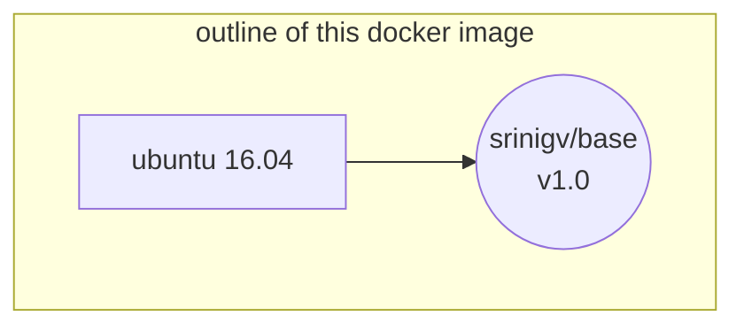

# srinigv docker base image

## Contains
* Ubuntu 16.04
* wget
* curl
* top
* ssh
* tig
* vim
* .vimrc
* git
* .gitconfig

## use this image as base
  FROM srinigv/base:v3.0

## build
  git clone https://github.com/srinigv/docker_base
  make build

## run this
  make run

# Outline of this image

